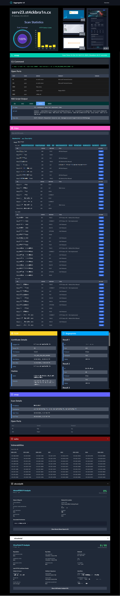
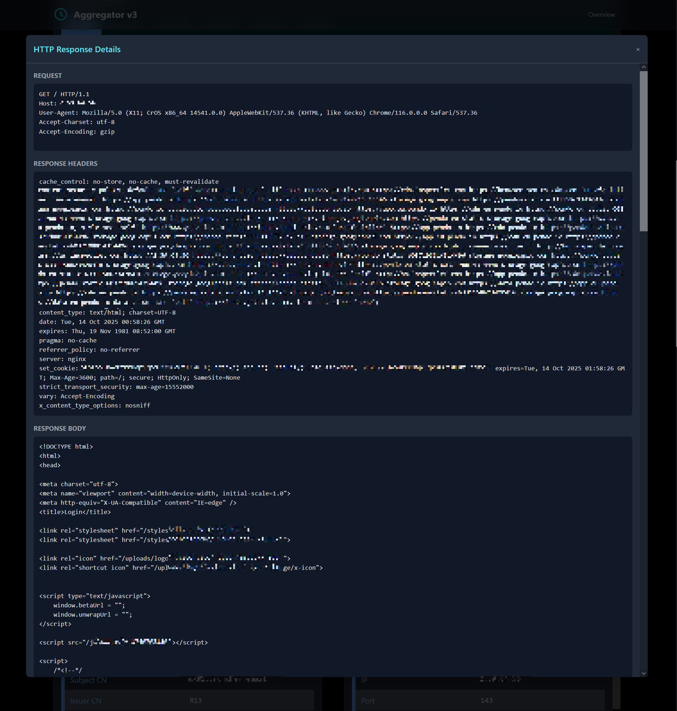
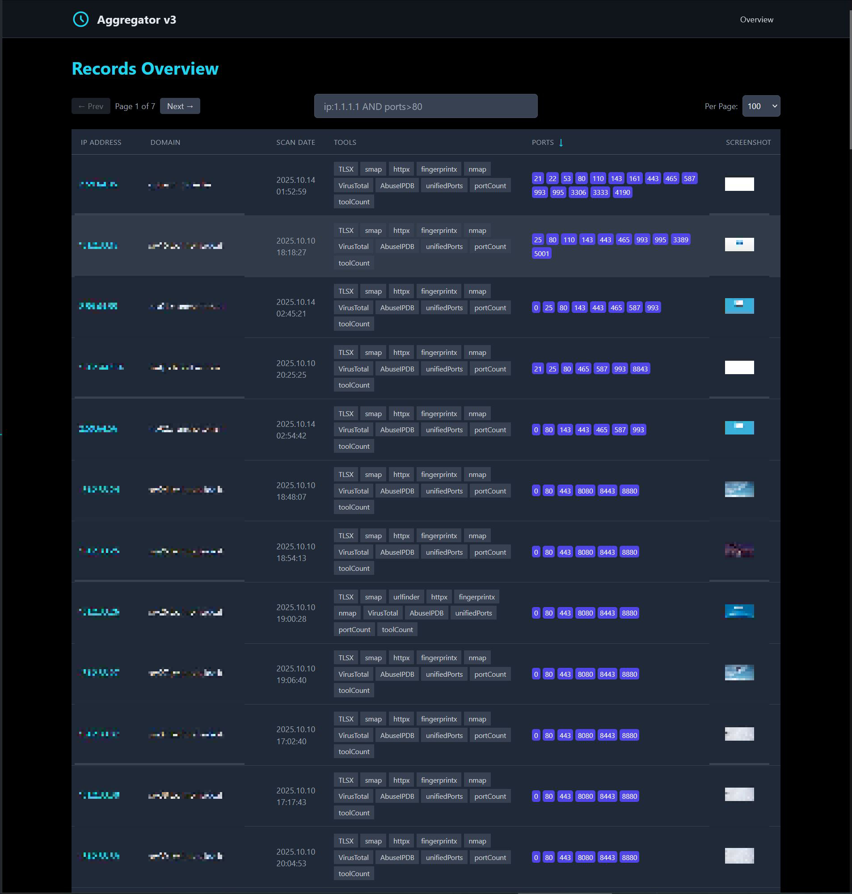
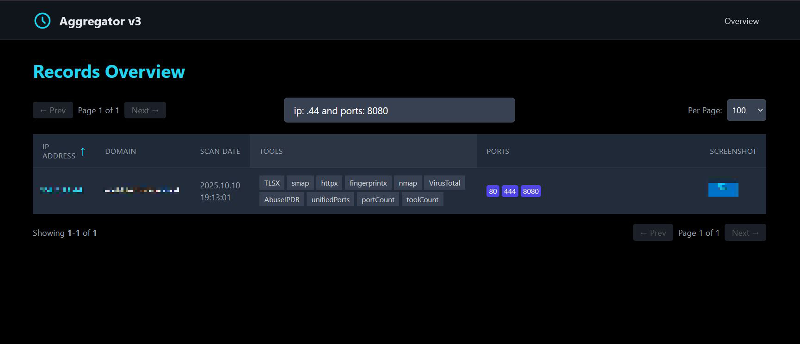

# AggreGat0r-v3
FOSS release of Chuck's favourite LONG RANGE scanner

## You got 2 choices... maybe more, maybe not!
- Chuck uses this tool with mongoDB
- Chuck can install all deps by himself without help from others, or AI
- Chuck knows, .env files are the true DANGER, but knows how to handle them ALL
- Chuck makes an automated reverse DNS lookup list, that must look like this:

```bash
192.168.23.23: sub.domain.example
192.168.23.24: sub2.domain.example
...
```

### Chuck knows, he can tackle LONG RANGE in 2 ways
- Start by making auto-screenshots (see frontend/public/screenshots) on TOP PERCENTER ports
- Start by making pd_scans (see backend/pd_scans) - the noisy bruteforce option

Chuck prefers on LONG RANGES to first make screenshots: They're unobtrusive and result in a good pre-sorting of > 64k targets. 

Chuck makes no mistakes. 

Once he got all screenshots: 
- Chuck uses the result extraction script (we will automate this further in an upcoming version)
- Chuck moves the screenshot image files TO THE ROOT of the screenshots folder
- Chuck passes the result extraction txt file to pd_scans (of course he's got installed those deps and filled all env vars)
- Chuck fires up the pd_scanner - it will add all results to mongoDB

Chuck is now confident and ready to run both frontend and backend. 

# Changes
Please note that everything presented is subject to change, that includes the data ingestion. Meaning at any new version, old data may no longer work. We recommend to keep the automatically created folders from autoscreenshot and pd_scans, so you can easily re-ingest, when we change some formats. 

# AggreGat0r v3 Demo
We already implemented vast improvements, search / filter, pagination, sorting, better HTTPX results with header and body, lots of layout fixes, VirusTotal and AbuesIPDB fix, ... 

Following demo screenshots were partly combined from several sources in an artistic manner, to demonstrate the capabilities of the platform. They still show the software very accurately, all features you see are present (as are a few bugs like the totalPorts in the list / tool section). We keep iterating as much as we can, it already has become an invaluable tool in our collection for larger tasks and long-term storage. As usual in offensive tools, this is not a one-click scans-ready platform, the actual ingestion happens on terminal level, as most of us are used to and love to, cause it's fastest and easiest. We just tried to provide tools to automate-away repetitive tasks. 







